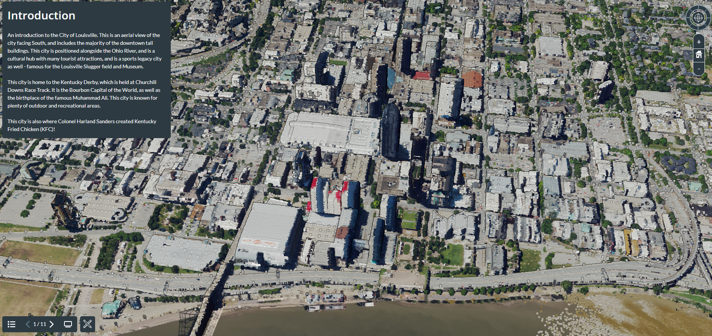

# GEO409-Final-Project
Three separate ways of visualizing maps using the same data sources. 

## 1) City of Louisville General Landmarks: 2 Differential Areas
This interactive map created on Cesium Ion offers 2 separate point clouds, the first being centered in downtown Louisville, and the second being centered over the University of Louisville's campus, also including Churchill Downs racetrack. This project was created to get a better understanding of the different kinds of landmarks in this city, and the different significances of those landmarks due to their unique surroundings.

I decided to highlight several different tourist attractions, green spaces/parks, and sports/concert stadiums to highlight great aspects of this particular city.

Cesium Ion Interactive Map: https://ion.cesium.com/stories/viewer/?id=ea183a30-9950-4bdf-bff2-d89c0dcf3219 

### Screenshot of Cesium Ion Presentation

## 2) Daily Solar Exposure in Downtown Louisville

## 3) City of Louisville Fly Through Animation

### Youtube URL

