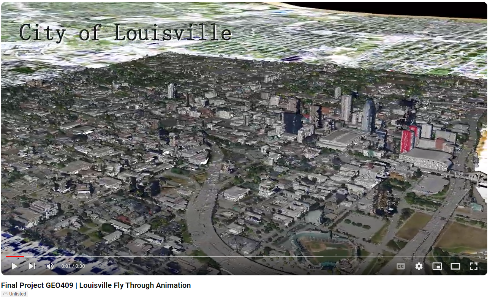

# GEO409-Final-Project
Three separate ways of visualizing maps using the same data sources. 

## 1) City of Louisville General Landmarks: 2 Differential Areas
This interactive map created on Cesium Ion offers 2 separate point clouds, the first being centered in downtown Louisville, and the second being centered over the University of Louisville's campus, also including Churchill Downs racetrack. This project was created to get a better understanding of the different kinds of landmarks in this city, and the different significances of those landmarks due to their unique surroundings.

I decided to highlight several different tourist attractions, green spaces/parks, and sports/concert stadiums to highlight great aspects of this particular city.

Cesium Ion Interactive Map: https://ion.cesium.com/stories/viewer/?id=ea183a30-9950-4bdf-bff2-d89c0dcf3219 

### Screenshot of Cesium Ion Presentation

## 2) Daily Solar Exposure in Downtown Louisville
This static map is representing data for a guide to solar mapping installations. Each tier is from a different time of day, with the sun at a different angle in the sky. Since the sun rise east to west, we can see that in each separate map. From this, one can infer which spots / buildig rooftops / open areas, would be appropriate to install solar panels. 

## 3) City of Louisville Fly Through Animation
This animation is made directly on ArcGIS Pro, and then upoladed to Youtube for viewing. It flies around the city and focuses on the downtown area. The skyline is easily viewable here, and the main aspect of the 3D data to show off.

### Youtube Link
URL: https://www.youtube.com/watch?v=M5VHKLuKy4s

### Screenshot of Youtube Video

