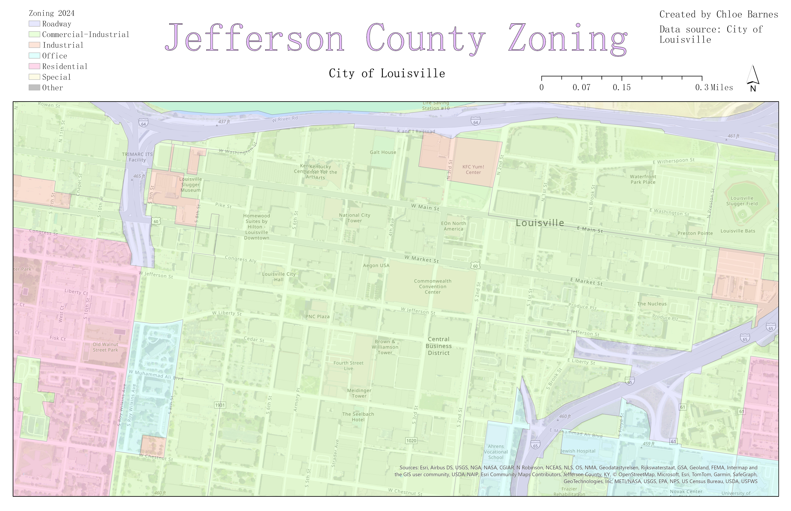

# GEO499-Final-Project
Three separate ways of visualizing maps using the same data sources. 

## 1) City of Louisville General Landmarks: 2 Differential Areas
This interactive map created on Cesium Ion offers 2 separate point clouds, the first being centered in downtown Louisville, and the second being centered over the University of Louisville's campus, also including Churchill Downs racetrack. This project was created to get a better understanding of the different kinds of landmarks in this city, and the different significances of those landmarks due to their unique surroundings.
Cesium Ion Interactive Map: https://ion.cesium.com/stories/viewer/?id=ea183a30-9950-4bdf-bff2-d89c0dcf3219 
### Screenshot of Cesium Ion Presentation

## 2a) Solar Map - Relative Sunlight Exposure in the City of Louisville

This map was created for a geography capstone project, and uses the same data as the first point cloud for downtown Louisville. I decided to include it because it serves as a resource to better comprehend what exact areas receive the most overall sunlight exposure throughout each day, and this can decipher what areas work best to install solar panels on building rooftops.

## 2b) Zoning Map 2024 - Map to Reference Types of Land Use and Development

This map serves as a reference to the map above, in case anyone is confused about what the area exactly covers, and what specific buildings and landmarks are included in the solar map. 

